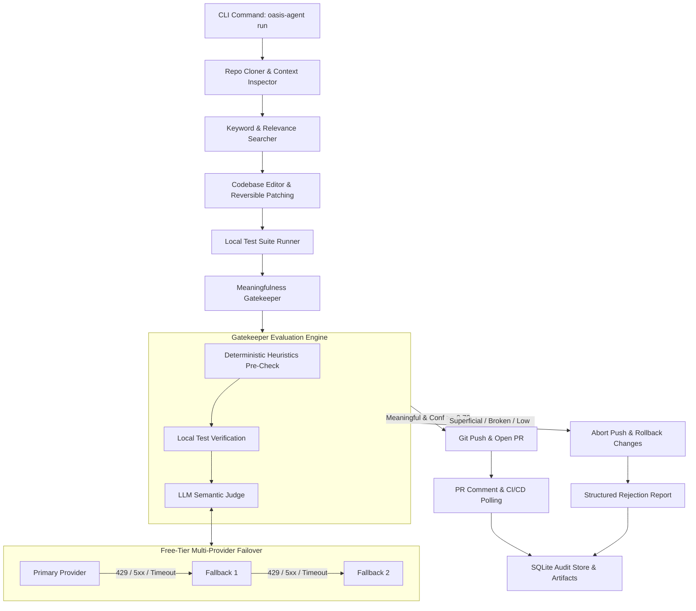

# oasis-agent

> **Autonomous CLI Agent that reviews and manages GitHub Pull Requests for meaningfulness before pushing, powered exclusively by free-tier LLM providers with automatic failover and CI/CD integration.**

---

## ⚠️ Data Privacy Notice

> [!WARNING]
> **Free-Tier LLM Provider Data Logging**
> `oasis-agent` is configured to route calls exclusively to free-tier LLM providers (**OpenRouter**, **Groq**, **Google AI Studio**, and **NVIDIA NIM**).
> 
> By utilizing these free services, your prompts, issue context, and repository diffs may be logged or processed according to each provider's specific terms of service.
> 
> **`oasis-agent` should ONLY be run against public repositories or codebases you are explicitly authorized to share with third-party model providers.** Do not run this tool on confidential or proprietary corporate source code without enterprise agreements in place.

---

## Architecture Overview



---

## Key Features

- **100% Free-Tier Provider Architecture**: Integrates **OpenRouter** (`deepseek-r1:free`, `qwen-2.5-coder-32b-instruct:free`, `llama-3.3-70b-instruct:free`), **Groq** (`llama-3.3-70b-versatile`), **Google AI Studio** (`gemini-flash-latest`), and **NVIDIA NIM** (`meta/llama-3.1-70b-instruct`). No paid API subscriptions required.
- **Dynamic Routing & Automatic Failover**: If the primary provider hits a rate limit (HTTP 429), server error (5xx), or times out, the agent retries with exponential backoff and automatically fails over to the next provider in the fallback chain.
- **Strict Meaningfulness Gatekeeper**: Evaluates proposed diffs across 4 core dimensions:
  1. **Relevance**: Does the diff touch files and logic directly tied to the issue?
  2. **Non-triviality**: Instantly rejects whitespace-only, comment-only, or no-op edits.
  3. **Correctness & Safety**: Validates syntax and ensures local unit tests pass.
  4. **Issue Closure Likelihood**: Analyzes whether maintainers would accept this as a complete fix.
- **Fail-Safe Git Operations**: Diffs are reversible. If a change is rejected, all edits are cleanly rolled back, no branch is pushed, and no noisy Pull Request is opened.
- **Dual Review Reporting**: Emits colored terminal output and exports both JSON and Markdown artifacts (`.oasis-agent/reports/run_<id>.md` and `.json`), plus persists every run to a local SQLite database (`.oasis-agent/history.db`).
- **CI/CD Integration**: Includes a ready-to-use GitHub Actions workflow (`.github/workflows/oasis-agent-check.yml`) that can gate human or bot PRs.

---

## Installation

### Prerequisites
- Python 3.10 or higher
- Git 2.25+ installed and on your PATH

### Setup

Clone the repository and install in editable mode:

```bash
git clone https://github.com/oasis-org/oasis.git
cd oasis
pip install -e .
```

Verify installation:
```bash
oasis-agent --version
oasis-agent --help
```

---

## Authentication & Configuration

Run the interactive setup assistant:

```bash
oasis-agent configure
```

This prompts for your API keys and writes them to a local `.env` file (which is automatically excluded in `.gitignore`):

| Variable | Provider | Purpose | Free Key URL |
| :--- | :--- | :--- | :--- |
| `OPENROUTER_API_KEY` | OpenRouter | Primary reasoning & judgment | [openrouter.ai/keys](https://openrouter.ai/keys) |
| `GROQ_API_KEY` | Groq | Fast search & code scanning | [console.groq.com/keys](https://console.groq.com/keys) |
| `GOOGLE_API_KEY` | Google AI Studio | Long-context repo ingestion | [aistudio.google.com/app/apikey](https://aistudio.google.com/app/apikey) |
| `NVIDIA_API_KEY` | NVIDIA NIM | Emergency backup fallback | [build.nvidia.com/](https://build.nvidia.com/) |
| `GITHUB_TOKEN` | GitHub | Cloning, opening PRs, issues | [github.com/settings/tokens](https://github.com/settings/tokens) |

> **Graceful Degradation**: You do not need keys for every provider to run. On startup, `oasis-agent` checks available keys and prunes missing providers from fallback chains without crashing.

Check your connectivity and rate limits anytime:
```bash
oasis-agent status
```

---

## Task-to-Provider Routing Table

Routing is fully customizable via `oasis-agent.config.yaml`:

```yaml
llm_routing:
  context_mapping:
    primary: google_gemini_flash
    fallback: [groq_llama, nvidia_nim]
  codebase_search:
    primary: groq_llama
    fallback: [openrouter_qwen_coder, nvidia_nim]
  code_editing:
    primary: openrouter_qwen_coder
    fallback: [openrouter_deepseek_r1, nvidia_nim]
  meaningfulness_judgment:
    primary: openrouter_deepseek_r1
    fallback: [openrouter_qwen_coder, nvidia_nim]
  pr_description_generation:
    primary: openrouter_deepseek_r1
    fallback: [openrouter_qwen_coder]
  review_report_generation:
    primary: openrouter_deepseek_r1
    fallback: [openrouter_qwen_coder]
```

---

## CLI Usage

### 🚀 Developer-Led Workflow (Human Writes Code, Agent Gatekeeps)

In this recommended workflow, **you write the code**, and the agent acts as your pre-push gatekeeper:

#### 1. Setup Your Workspace on an Issue
```bash
oasis-agent work --repo https://github.com/owner/repo --issue 42
```
- Clones the repo locally into `./<repo-name>` (connected to `.git` and origin remote).
- Fetches Issue #42 from GitHub and stores context in `.oasis-agent/issue.json`.
- Creates and checks out isolated branch: `oasis-agent/fix-issue-42`.
- Detects the project stack and test commands.

#### 2. Write Your Code
Open the cloned folder in VS Code / your IDE, modify code, and add tests.

#### 3. Test or Push with the Gatekeeper
From inside your repository folder:
```bash
# Pre-flight check: evaluate your diff against the issue without pushing (interactive dry-run)
oasis-agent check

# When ready: evaluate meaningfulness, push branch to remote, open a GitHub PR, and auto-cleanup local workspace
oasis-agent push

# To preserve local files instead of cleaning up automatically:
oasis-agent push --keep
```
- If **Meaningful (Approved)**: Commits changes, pushes branch to GitHub, opens a PR with auto-generated description and gatekeeper review comment, and automatically cleans up the local repository workspace! (Audit history and reports remain permanently stored in `~/.oasis-agent/`).
- If **Not Meaningful (Rejected)**: **Blocks and aborts the push!** Leaves your local code completely untouched so you can refine your solution.

---

### Autonomous Run (Agent Proposes Edits)
```bash
# Fully autonomous mode where agent attempts to synthesize a code patch
oasis-agent run --repo https://github.com/owner/repo --issue 42

# Safe dry-run
oasis-agent run --repo https://github.com/owner/repo --issue 42 --dry-run
```

### Review an Existing Pull Request
Evaluate an existing PR on GitHub against its linked issue:
```bash
oasis-agent review 102 --repo owner/repo
```

### Check Run History & Audits
Inspect historical runs saved in SQLite:
```bash
oasis-agent history --limit 10
```

---

## Exit Codes

| Code | Meaning |
| :---: | :--- |
| `0` | **Success**: PR created or dry-run evaluation succeeded. |
| `1` | **Rejected**: Proposed patch was rejected by the Gatekeeper (not meaningful, broken tests, or trivial diff). |
| `2` | **LLM Unavailable**: All candidate providers in the failover chain failed or were rate-limited. |
| `3` | **General Error**: Network error, git error, or invalid arguments. |

---

## Worked Examples

Sample outputs are available in the [`examples/`](file:///d:/GitHub/oasis/examples/) directory:

- [Accepted Meaningful Fix Report (Markdown)](file:///d:/GitHub/oasis/examples/accepted_run_report.md)
- [Accepted Meaningful Fix Report (JSON)](file:///d:/GitHub/oasis/examples/accepted_run_report.json)
- [Rejected Superficial Fix Report (Markdown)](file:///d:/GitHub/oasis/examples/rejected_run_report.md)
- [Rejected Superficial Fix Report (JSON)](file:///d:/GitHub/oasis/examples/rejected_run_report.json)

---

## GitHub Actions CI/CD Integration

To gate PRs in your GitHub repositories using `oasis-agent`, add `.github/workflows/oasis-agent-check.yml` to your repo:

```yaml
name: oasis-agent PR Gatekeeper

on:
  pull_request:
    types: [opened, synchronize, reopened]

jobs:
  gatekeeper-check:
    runs-on: ubuntu-latest
    steps:
      - uses: actions/checkout@v4
      - uses: actions/setup-python@v5
        with:
          python-version: "3.11"
      - run: pip install oasis-agent
      - name: Meaningfulness Gatekeeper Check
        env:
          OPENROUTER_API_KEY: ${{ secrets.OPENROUTER_API_KEY }}
          GROQ_API_KEY: ${{ secrets.GROQ_API_KEY }}
          GOOGLE_API_KEY: ${{ secrets.GOOGLE_API_KEY }}
          GITHUB_TOKEN: ${{ secrets.GITHUB_TOKEN }}
        run: |
          oasis-agent review "${{ github.event.pull_request.number }}" --repo "${{ github.repository }}"
```

---

## Running Tests

Run the test suite:
```bash
pytest -v
```

All 19 tests cover heuristics, LLM failover, parser sanitization, git branching, repo context mapping, and CLI commands.

---

## License

MIT License. See `LICENSE` for details.
