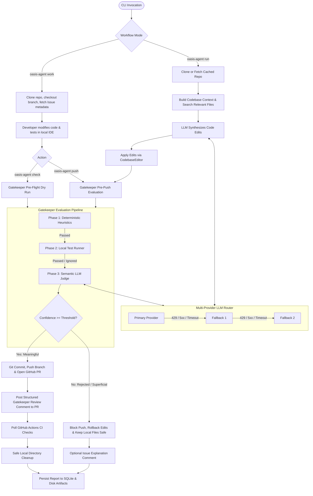
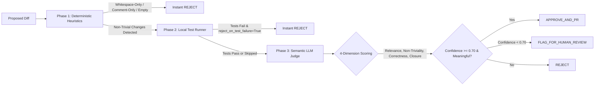
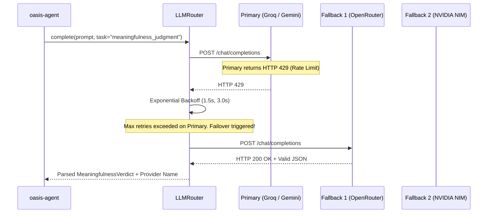

# oasis-agent

> **Autonomous CLI Agent & Pre-Push Gatekeeper for GitHub Pull Requests, powered exclusively by free-tier LLM providers with dynamic multi-provider failover, deterministic heuristics, local test verification, and automated CI/CD integration.**

---

## Table of Contents
1. [⚠️ Data Privacy & Free-Tier Notice](#️-data-privacy--free-tier-notice)
2. [Agent Architecture & Lifecycle](#agent-architecture--lifecycle)
3. [Core Capabilities & Value Proposition](#core-capabilities--value-proposition)
4. [Installation & Prerequisites](#installation--prerequisites)
5. [Authentication & Secrets Resolution](#authentication--secrets-resolution)
6. [Complete CLI Command & Endpoint Reference](#complete-cli-command--endpoint-reference)
   - [`oasis-agent configure`](#oasis-agent-configure)
   - [`oasis-agent status`](#oasis-agent-status)
   - [`oasis-agent work`](#oasis-agent-work)
   - [`oasis-agent check`](#oasis-agent-check)
   - [`oasis-agent push`](#oasis-agent-push)
   - [`oasis-agent run`](#oasis-agent-run)
   - [`oasis-agent review`](#oasis-agent-review)
   - [`oasis-agent history`](#oasis-agent-history)
7. [Programmatic Python API & Component Endpoints](#programmatic-python-api--component-endpoints)
8. [Meaningfulness Gatekeeper Evaluation Engine](#meaningfulness-gatekeeper-evaluation-engine)
9. [LLM Dynamic Routing & Automatic Failover Engine](#llm-dynamic-routing--automatic-failover-engine)
10. [Exhaustive Configuration Reference (`oasis-agent.config.yaml`)](#exhaustive-configuration-reference-oasis-agentconfigyaml)
11. [Repository File Inventory & Purpose Breakdown](#repository-file-inventory--purpose-breakdown)
12. [CI/CD Integration (GitHub Actions)](#cicd-integration-github-actions)
13. [Exit Codes](#exit-codes)
14. [Testing & Verification](#testing--verification)
15. [License](#license)

---

## ⚠️ Data Privacy & Free-Tier Notice

> [!WARNING]
> **Third-Party Model Logging Notice**
> `oasis-agent` is designed to run exclusively against free-tier LLM provider endpoints (**OpenRouter**, **Groq**, **Google AI Studio**, and **NVIDIA NIM**).
>
> By utilizing these free-tier APIs, prompts containing issue descriptions, file context, and diff patches may be logged and processed by these providers under their respective free-tier Terms of Service.
>
> **`oasis-agent` should ONLY be executed against public repositories or codebases you are authorized to share with third-party providers.** Never execute this tool on sensitive, proprietary, or regulated private source code without enterprise confidentiality agreements in place.

---

## Agent Architecture & Lifecycle

The agent operates in two primary operational paradigms:
1. **Developer-Led Workflow**: The human engineer develops the patch locally; `oasis-agent` serves as an interactive, pre-push gatekeeper that evaluates code meaningfulness, executes the local test suite, commits/pushes to remote origin, opens the PR, posts a gatekeeper review comment, and automatically cleans up the local workspace.
2. **Fully Autonomous Remediation**: Given only an issue number and repository URL, `oasis-agent` clones the repository, inspects the tech stack, performs keyword and relevance searches, synthesizes a code patch with an LLM, runs local tests, evaluates the diff through the gatekeeper, and conditionally opens a Pull Request or aborts and rolls back.



---

## Core Capabilities & Value Proposition

- **100% Free-Tier Provider Stack**: Out of the box, `oasis-agent` requires **zero paid subscriptions**. It connects to:
  - **OpenRouter** (DeepSeek-R1, Qwen-2.5-Coder-32B, Nemotron, MiniMax)
  - **Groq** (Llama-3.3-70B-Versatile, GPT-OSS-120B, Qwen-3.8-27B)
  - **Google AI Studio** (Gemini-Flash-Latest)
  - **NVIDIA NIM** (Llama-3.2-11B-Vision, Llama-3.1-70B)
- **Automatic Multi-Provider Failover**: Free APIs frequently return HTTP 429 (rate limits) or 5xx server errors. The built-in `LLMClient` automatically detects rate limits, performs exponential backoff retries, and cascades down the fallback chain to the next provider without crashing.
- **Strict 4-Dimensional Gatekeeper**: Every proposed change is evaluated across:
  1. **Relevance**: Does the change directly address the reported problem?
  2. **Non-Triviality**: Instant rejection of comment-only, whitespace-only, docstring-only, or no-op changes.
  3. **Correctness & Safety**: Validates syntax, adherence to idioms, and absence of regressions.
  4. **Issue Closure Likelihood**: Analyzes whether maintainers would accept this patch as a complete resolution.
- **Fail-Safe Git Mechanics**: All autonomous edits are recorded by a reversible virtual editor (`CodebaseEditor`). If rejected, changes are cleanly reverted, ensuring zero dirty git working trees or noisy pull requests.
- **Automated Local Workspace Lifecycle**: In developer-led mode, once your code is approved and pushed, the agent automatically cleans up the local repository workspace so your disk remains clutter-free (can be overridden with `--keep`).
- **Dual-Tier Audit & Persistence**: Every run records full JSON and Markdown summaries under `.oasis-agent/reports/` and syncs structured run metrics to both local (`./.oasis-agent/history.db`) and user-global (`~/.oasis-agent/history.db`) SQLite databases.

---

## Installation & Prerequisites

### Prerequisites
- **Python**: 3.10, 3.11, or 3.12+
- **Git**: 2.25+ installed and available on your system `PATH`
- **GitHub Account & PAT**: Personal Access Token with repository permissions

### Installation Steps

1. **Clone and Install Locally**:
   ```bash
   git clone https://github.com/oasis-org/oasis.git
   cd oasis/agent
   pip install -e .
   ```

2. **Verify Installation**:
   ```bash
   oasis-agent --version
   oasis-agent --help
   ```

---

## Authentication & Secrets Resolution

Run the interactive setup assistant to configure your credentials:

```bash
oasis-agent configure
```

This writes credentials into `.env` (automatically ensuring `.env` is declared in `.gitignore`).

### Environment Variable Discovery Order
The agent searches for environment variables in the following cascade:
1. Active process environment variables (`os.environ`)
2. Current working directory `.env`
3. Package root `.env` (`oasis/agent/.env`)
4. Global user configuration `.env` (`~/.oasis-agent/.env`)

### Supported API Keys

| Environment Variable | Provider / Service | Default Usage | Where to Obtain Key |
| :--- | :--- | :--- | :--- |
| `OPENROUTER_API_KEY` | OpenRouter | Code editing, reasoning, JSON fallback | [openrouter.ai/keys](https://openrouter.ai/keys) |
| `GROQ_API_KEY` | Groq | High-speed semantic search & judgment | [console.groq.com/keys](https://console.groq.com/keys) |
| `GOOGLE_API_KEY` | Google AI Studio | Long-context repo ingestion & fallback | [aistudio.google.com/app/apikey](https://aistudio.google.com/app/apikey) |
| `NVIDIA_API_KEY` | NVIDIA NIM | Emergency failover fallback | [build.nvidia.com/](https://build.nvidia.com/) |
| `GITHUB_TOKEN` | GitHub API / Git CLI | Fetching issues, git push, opening PRs | [github.com/settings/tokens](https://github.com/settings/tokens) |

> **Graceful Degradation**: You do NOT need all four LLM keys to operate. The agent automatically detects active keys on startup and prunes unavailable providers from the failover chain.

---

## Complete CLI Command & Endpoint Reference

The CLI entrypoint is powered by `typer` and `rich`. Below is every command, argument, flag, and option available.

### `oasis-agent configure`
Interactively prompts for API keys (masking existing keys) and writes them to `.env`. Also marks the data privacy notice as accepted in `oasis-agent.config.yaml`.
- **Usage**:
  ```bash
  oasis-agent configure
  ```

---

### `oasis-agent status`
Performs live health checks against all configured LLM providers by dispatching a minimal ping test, measuring latency in milliseconds, and validating GitHub token scopes and hourly rate limits.
- **Usage**:
  ```bash
  oasis-agent status [--config <path>]
  ```
- **Options**:
  - `-c`, `--config` *[PATH]*: Path to custom YAML configuration file.

---

### `oasis-agent work`
Initializes a local developer workspace for an issue. Clones the repository locally (into `./<repo-name>` by default), switches to an isolated branch `oasis-agent/fix-issue-<id>`, fetches the GitHub issue metadata, saves context to `.oasis-agent/issue.json`, and detects project test commands.
- **Usage**:
  ```bash
  oasis-agent work --repo <REPO> --issue <ISSUE_NUMBER> [--dir <DIR>] [--config <PATH>]
  ```
- **Options**:
  - `-r`, `--repo` *[TEXT]* **(Required)**: GitHub repository URL (`https://github.com/owner/repo`) or `owner/repo` identifier.
  - `-i`, `--issue` *[INTEGER]* **(Required)**: Issue number to link and resolve.
  - `-d`, `--dir` *[TEXT]*: Custom local directory destination (defaults to `./<repo-name>`).
  - `-c`, `--config` *[PATH]*: Path to custom YAML configuration file.

---

### `oasis-agent check`
Runs a dry-run pre-flight gatekeeper check on your local changes. Inspects unstaged and staged diffs against the base branch, executes the local test suite, and runs the 4-dimensional Meaningfulness Gatekeeper. **No commits are made and no remote git actions occur.**
- **Usage**:
  ```bash
  cd ./<repo-name>
  oasis-agent check [--dir <PATH>] [--config <PATH>]
  ```
- **Options**:
  - `-d`, `--dir` *[TEXT]*: Path to repository workspace (defaults to current directory).
  - `-c`, `--config` *[PATH]*: Path to custom YAML configuration file.
- **Exit Codes**: Returns `0` if approved, `1` if rejected.

---

### `oasis-agent push`
The culmination of the Developer-Led workflow. Inspects your workspace diff, runs tests, and queries the Gatekeeper:
- **If Approved**: Stages all changes (excluding `.oasis-agent/`), creates a conventional commit, pushes to remote origin, opens a GitHub PR, posts a structured gatekeeper review comment, polls CI, and automatically deletes the local workspace directory (`--clean`).
- **If Rejected**: **Blocks and aborts the push.** Leaves all local files untouched so you can continue refining your code.
- **Usage**:
  ```bash
  cd ./<repo-name>
  oasis-agent push [--dir <PATH>] [--dry-run] [--clean / --keep] [--post-rejection-comment / --no-post-rejection-comment] [--config <PATH>]
  ```
- **Options**:
  - `-d`, `--dir` *[TEXT]*: Path to repository workspace (defaults to current directory).
  - `--dry-run`: Evaluate gatekeeper verdict without executing git push or creating PR.
  - `--clean` / `--keep` *(Default: `--clean`)*: Clean up and delete local workspace upon successful PR creation (`--keep` preserves local files).
  - `--post-rejection-comment`: Post an explanation comment to the GitHub issue if rejected.
  - `-c`, `--config` *[PATH]*: Path to custom YAML configuration file.

---

### `oasis-agent run`
Executes end-to-end autonomous remediation. The agent clones the repo, identifies the tech stack, searches relevant files, prompts the LLM to generate code edits, applies reversible patches, runs local tests, evaluates meaningfulness, and opens a Pull Request or rolls back.
- **Usage**:
  ```bash
  oasis-agent run --repo <REPO> --issue <ISSUE_NUMBER> [--dry-run] [--clean / --keep] [--post-rejection-comment] [--config <PATH>]
  ```
- **Options**:
  - `-r`, `--repo` *[TEXT]* **(Required)**: GitHub repository URL or `owner/repo`.
  - `-i`, `--issue` *[INTEGER]* **(Required)**: Issue number to resolve.
  - `--dry-run`: Synthesize and evaluate patch without pushing to remote or opening PR.
  - `--clean` / `--keep` *(Default: `--clean`)*: Delete local repository after successful PR creation.
  - `--post-rejection-comment`: Post comment to GitHub issue explaining rejection.
  - `-c`, `--config` *[PATH]*: Path to custom YAML configuration file.

---

### `oasis-agent review`
Evaluates an **already existing Pull Request** on GitHub against its linked issue or description. Fetches the PR diff via the GitHub API and renders a complete gatekeeper verdict.
- **Usage**:
  ```bash
  oasis-agent review <PR_NUMBER> --repo <REPO> [--config <PATH>]
  ```
- **Arguments**:
  - `PR_NUMBER` *[INTEGER]* **(Required)**: The pull request number to inspect.
- **Options**:
  - `-r`, `--repo` *[TEXT]* **(Required)**: Target GitHub repository (`owner/repo` or URL).
  - `-c`, `--config` *[PATH]*: Path to custom YAML configuration file.

---

### `oasis-agent history`
Queries the SQLite audit database and displays a tabular log of recent agent runs, status, gatekeeper verdicts, confidence scores, and created PR links.
- **Usage**:
  ```bash
  oasis-agent history [--limit <INT>] [--config <PATH>]
  ```
- **Options**:
  - `-n`, `--limit` *[INTEGER]* *(Default: 10)*: Number of historical runs to display.
  - `-c`, `--config` *[PATH]*: Path to custom YAML configuration file.

---

## Programmatic Python API & Component Endpoints

`oasis-agent` is structured with clean modular interfaces. You can integrate its core components directly in Python applications:

```python
from oasis_agent.config import load_config
from oasis_agent.orchestrator import OasisAgentOrchestrator
from oasis_agent.evaluator.judge import MeaningfulnessJudge
from oasis_agent.llm.client import LLMClient
from oasis_agent.models import IssueContext, GitDiffSummary

# 1. Initialize configuration and orchestrator
config = load_config("oasis-agent.config.yaml")
orchestrator = OasisAgentOrchestrator(config=config)

# 2. Run developer-led workspace setup
workspace_info = orchestrator.prepare_workspace(
    repo_url_or_path="https://github.com/owner/repo",
    issue_number=42,
    target_dir="./my-workspace",
)

# 3. Direct Gatekeeper Evaluation
llm_client = LLMClient(config=config)
judge = MeaningfulnessJudge(llm_client, gatekeeper_config=config.gatekeeper)

issue = IssueContext(
    repo_url="https://github.com/owner/repo",
    repo_name="owner/repo",
    issue_number=42,
    title="Fix division by zero in calculator",
    body="Calculator crashes when dividing any float by zero.",
)

diff = GitDiffSummary(
    files_changed=["calculator/ops.py"],
    insertions=3,
    deletions=1,
    diff_content="""--- a/calculator/ops.py\n+++ b/calculator/ops.py\n@@ -10,1 +10,3 @@\n def divide(a, b):\n+    if b == 0:\n+        raise ValueError("Cannot divide by zero")\n     return a / b\n""",
)

verdict = judge.evaluate(issue=issue, diff_summary=diff)
print(f"Meaningful: {verdict.meaningful}, Confidence: {verdict.confidence}")
print(f"Recommended Action: {verdict.recommended_action}")
```

### Key Python Class Endpoints

| Class | Module | Primary Methods | Description |
| :--- | :--- | :--- | :--- |
| `OasisAgentOrchestrator` | `oasis_agent.orchestrator` | `prepare_workspace()`, `evaluate_and_push()`, `run()`, `cleanup_workspace()` | Master orchestrator coordinating git, LLMs, tests, and reporting |
| `MeaningfulnessJudge` | `oasis_agent.evaluator.judge` | `evaluate(issue, diff_summary, test_results)` | Multi-phase evaluator (heuristics -> tests -> LLM semantic judge) |
| `LocalTestRunner` | `oasis_agent.evaluator.test_runner` | `run_tests(timeout_seconds=60)` | Auto-detects test frameworks (`pytest`, `npm test`, `cargo test`, etc.) |
| `LLMClient` | `oasis_agent.llm.client` | `complete(prompt, task_type, response_model)` | Completion caller with automated retry and multi-provider failover |
| `LLMRouter` | `oasis_agent.llm.router` | `get_routing_chain()`, `check_provider_health()` | Resolves fallback chains and validates provider health / latency |
| `GitClient` | `oasis_agent.git_ops.client` | `stage_all()`, `commit()`, `push()`, `get_diff()` | Safe Git subprocess wrapper ensuring `.oasis-agent/` exclusion |
| `GitHubClientManager`| `oasis_agent.github_api.client`| `client`, `execute_with_backoff()`, `get_rate_limit_info()` | PyGithub manager with primary & secondary rate-limit backoff |
| `RepoInspector` | `oasis_agent.repo_context.inspector`| `detect_stack()`, `build_file_tree()`, `get_summary_context()` | Detects programming languages, manifests, and file hierarchies |
| `CodebaseEditor` | `oasis_agent.repo_context.editor` | `edit_file()`, `create_file()`, `rollback_all()`, `compute_diff_summary()` | Virtual patcher allowing reversible diffs and full clean rollback |
| `HistoryStore` | `oasis_agent.reporter.store` | `save_run()`, `get_recent_runs()` | Dual SQLite persistence store for run metrics and verdicts |

---

## Meaningfulness Gatekeeper Evaluation Engine

The Gatekeeper enforces strict quality control before any code can be committed or pushed:



### The Four Evaluation Dimensions
1. **Relevance (Weight: High)**:
   - Does the diff touch files directly implicated in the issue?
   - Rejects off-topic refactorings or cosmetic cleanups that do not address the core issue.
2. **Non-Triviality (Weight: High)**:
   - Rejects changes that only modify comments, reformat spacing, bump arbitrary version tags, or add no-op logic.
3. **Correctness & Safety (Weight: Critical)**:
   - Validates that the patch maintains syntactical integrity, adheres to idioms, avoids introducing security anti-patterns, and passes all local automated unit tests.
4. **Issue Closure Likelihood (Weight: Critical)**:
   - Assesses whether repository maintainers would accept this patch as a complete and sufficient resolution.

---

## LLM Dynamic Routing & Automatic Failover Engine

Every LLM task is routed through specialized fallback chains defined in `oasis-agent.config.yaml`.



### Structured Output Resilience
- **Reasoning Tag Stripping**: Models such as DeepSeek-R1 output `<think>...</think>` blocks. `oasis_agent.llm.parser` cleanses thinking tokens before parsing JSON.
- **Markdown Fence Stripping**: Automatically extracts JSON embedded inside triple backtick blocks (````json ... ````).
- **Strict One-Shot Retry**: If a provider returns malformed JSON, `LLMClient` immediately executes one strict corrective prompt (`JSON_STRICT_RETRY_PROMPT`) at `temperature=0.1` before escalating to the next provider in the chain.

---

## Exhaustive Configuration Reference (`oasis-agent.config.yaml`)

Configuration is managed via `oasis-agent.config.yaml` and validated through Pydantic v2 schemas (`oasis_agent.config.OasisConfig`).

```yaml
# oasis-agent Configuration File
version: "1.0"

# ----------------------------------------------------------------------
# 1. LLM Providers Configuration (All Free-Tier APIs)
# ----------------------------------------------------------------------
providers:
  google_gemini_flash:
    base_url: "https://generativelanguage.googleapis.com/v1beta/openai"
    model: "gemini-flash-latest"
    api_key_env: "GOOGLE_API_KEY"
    timeout_seconds: 45
    max_retries: 2

  groq_gpt_oss:
    base_url: "https://api.groq.com/openai/v1"
    model: "openai/gpt-oss-120b"
    api_key_env: "GROQ_API_KEY"
    timeout_seconds: 30
    max_retries: 2

  groq_qwen:
    base_url: "https://api.groq.com/openai/v1"
    model: "qwen/qwen3.8-27b"
    api_key_env: "GROQ_API_KEY"
    timeout_seconds: 30
    max_retries: 2

  openrouter_nemotron:
    base_url: "https://openrouter.ai/api/v1"
    model: "nvidia/nemotron-3-nano-omni-30b-a3b-reasoning:free"
    api_key_env: "OPENROUTER_API_KEY"
    timeout_seconds: 35
    max_retries: 2

  openrouter_minimax:
    base_url: "https://openrouter.ai/api/v1"
    model: "minimax/minimax-m3:free"
    api_key_env: "OPENROUTER_API_KEY"
    timeout_seconds: 35
    max_retries: 2

  nvidia_nim:
    base_url: "https://integrate.api.nvidia.com/v1"
    model: "meta/llama-3.2-11b-vision-instruct"
    api_key_env: "NVIDIA_API_KEY"
    timeout_seconds: 30
    max_retries: 2

# ----------------------------------------------------------------------
# 2. Dynamic Task-to-Provider Routing with Fallback Chains
# ----------------------------------------------------------------------
llm_routing:
  context_mapping:
    primary: "groq_gpt_oss"
    fallback: ["google_gemini_flash", "nvidia_nim"]
  codebase_search:
    primary: "groq_gpt_oss"
    fallback: ["groq_qwen", "google_gemini_flash"]
  code_editing:
    primary: "groq_gpt_oss"
    fallback: ["google_gemini_flash", "openrouter_nemotron", "nvidia_nim"]
  meaningfulness_judgment:
    primary: "groq_gpt_oss"
    fallback: ["google_gemini_flash", "openrouter_nemotron", "nvidia_nim"]
  pr_description_generation:
    primary: "groq_gpt_oss"
    fallback: ["google_gemini_flash", "openrouter_minimax"]
  review_report_generation:
    primary: "groq_gpt_oss"
    fallback: ["google_gemini_flash", "openrouter_minimax"]

# ----------------------------------------------------------------------
# 3. Meaningfulness Gatekeeper Parameters
# ----------------------------------------------------------------------
gatekeeper:
  confidence_threshold: 0.70      # Minimum confidence (0.0 - 1.0) required for approval
  run_local_tests: true           # Execute detected test command before judgment
  reject_on_test_failure: true    # Immediately reject change if test suite fails
  reject_on_empty_diff: true      # Heuristic: reject if 0 additions / deletions
  reject_on_whitespace_only: true # Heuristic: reject whitespace-only diffs
  reject_on_comment_only: true    # Heuristic: reject changes touching only comments/docstrings

# ----------------------------------------------------------------------
# 4. Git & GitHub Defaults
# ----------------------------------------------------------------------
git:
  branch_prefix: "oasis-agent/fix-issue-"  # Branch naming template
  commit_message_prefix: "fix"             # Conventional commit prefix
  shallow_clone: true                      # Use --depth=1 for fast cloning
  cache_dir: ".oasis-agent/cache"          # Local repository cache folder

# ----------------------------------------------------------------------
# 5. Reporting & Audit Store
# ----------------------------------------------------------------------
reporting:
  output_dir: ".oasis-agent/reports"       # Artifact destination for .json and .md
  database_path: ".oasis-agent/history.db" # Local SQLite audit store path
  comment_on_rejection: false              # Post comment to issue if rejected
  clean_workspace_on_success: true         # Automatically remove local repo workspace upon successful PR

# ----------------------------------------------------------------------
# 6. Privacy Notice
# ----------------------------------------------------------------------
privacy:
  warning_dismissed: true                  # Suppress startup privacy notice
```

---

## Repository File Inventory & Purpose Breakdown

The following is an exhaustive directory inventory explaining the exact purpose and responsibilities of every file in the `oasis-agent` codebase.

```
agent/
├── .env                                # Local secrets file for provider API tokens & GITHUB_TOKEN
├── oasis-agent.config.yaml             # Primary YAML configuration file
├── pyproject.toml                      # Build definitions, dependencies, and CLI script entrypoint
├── README.md                           # Documentation and technical guide
├── oasis_agent/
│   ├── __init__.py                     # Package metadata and version definition
│   ├── cli.py                          # Typer CLI application, commands, options, and Rich UI
│   ├── config.py                       # Pydantic configuration schemas, loader, and finder
│   ├── models.py                       # Pydantic domain models (verdicts, diffs, metrics, reports)
│   ├── orchestrator.py                 # Core engine managing developer & autonomous lifecycles
│   ├── evaluator/
│   │   ├── __init__.py                 # Evaluator package exports
│   │   ├── heuristics.py               # Fast deterministic checks (empty, whitespace, comment diffs)
│   │   ├── judge.py                    # 4-dimensional semantic LLM gatekeeper judge
│   │   └── test_runner.py              # Local test suite discoverer and runner
│   ├── git_ops/
│   │   ├── __init__.py                 # Git operations package exports
│   │   ├── branch_manager.py           # Branch naming and rollback cleanup manager
│   │   └── client.py                   # High-level Git CLI client with token authentication & exclude rules
│   ├── github_api/
│   │   ├── __init__.py                 # GitHub API package exports
│   │   ├── checks.py                   # GitHub Actions check runs monitor and poller
│   │   ├── client.py                   # Authenticated PyGithub manager with rate-limit backoff
│   │   ├── issues.py                   # Issue fetching and comment posting manager
│   │   └── pull_requests.py            # Pull Request creation and comment manager
│   ├── llm/
│   │   ├── __init__.py                 # LLM package exports
│   │   ├── client.py                   # Multi-provider failover LLM caller with JSON retries
│   │   ├── parser.py                   # Resilient JSON stripper for reasoning tags & code fences
│   │   ├── prompts.py                  # System & user prompt templates for evaluation & editing
│   │   ├── providers.py                # HTTP client adapter for OpenAI-compatible free-tier endpoints
│   │   └── router.py                   # Task routing table resolver and health/latency checker
│   ├── repo_context/
│   │   ├── __init__.py                 # Repo context package exports
│   │   ├── cloner.py                   # Git repo cloner with shallow default and local cache
│   │   ├── editor.py                   # Reversible patch manager with rollback support
│   │   ├── inspector.py                # Tech stack, manifest, and test command detector
│   │   └── search.py                   # Keyword extraction and codebase relevance ranking
│   └── reporter/
│       ├── __init__.py                 # Reporter package exports
│       ├── comments.py                 # Markdown comment generators for PRs and issues
│       ├── formatter.py                # Rich CLI terminal formatter and Markdown/JSON exporter
│       └── store.py                    # SQLite database audit store (local and global)
└── tests/
    ├── test_cli.py                     # CLI command integration tests
    ├── test_developer_workflow.py      # End-to-end tests for work -> check -> push workflow
    ├── test_evaluator.py               # Unit tests for heuristics and gatekeeper judge
    ├── test_git_ops.py                 # Unit tests for GitClient and branch operations
    ├── test_llm_client.py              # Tests for multi-provider failover and JSON parsing
    ├── test_repo_context.py            # Tests for repo cloner, inspector, and searcher
    └── test_workspace_cleanup.py       # Tests for safe post-PR directory deletion
```

### Detailed File Responsibilities

#### Root Configuration Files
- **[`oasis-agent.config.yaml`](file:///d:/GitHub/oasis/agent/oasis-agent.config.yaml)**: Declarative settings controlling model endpoints, task routing chains, gatekeeper thresholds, git defaults, and report output paths.
- **[`pyproject.toml`](file:///d:/GitHub/oasis/agent/pyproject.toml)**: Standard PEP 621 package metadata specifying dependencies (`typer`, `rich`, `pydantic`, `httpx`, `PyGithub`, `pyyaml`, `python-dotenv`) and registering the `oasis-agent` console script.
- **[`.env`](file:///d:/GitHub/oasis/agent/.env)**: Key-value store for private API keys and tokens. Automatically excluded by `.gitignore`.

#### Core Package (`oasis_agent/`)
- **[`oasis_agent/__init__.py`](file:///d:/GitHub/oasis/agent/oasis_agent/__init__.py)**: Declares `__version__ = "0.1.0"`.
- **[`oasis_agent/cli.py`](file:///d:/GitHub/oasis/agent/oasis_agent/cli.py)**: The command-line interface. Contains commands for `configure`, `status`, `work`, `check`, `push`, `run`, `review`, and `history`. Renders rich tables, handles Windows terminal encodings, and maps command arguments to orchestrator actions.
- **[`oasis_agent/config.py`](file:///d:/GitHub/oasis/agent/oasis_agent/config.py)**: Configuration layer using Pydantic models. Resolves `.env` files from current directory, package directory, and home directory. Implements `find_config_file()`, `load_config()`, and `save_config()`.
- **[`oasis_agent/models.py`](file:///d:/GitHub/oasis/agent/oasis_agent/models.py)**: Domain models including `TaskType`, `CodeFileEdit`, `CodeEditsProposal`, `RunStatus`, `EvaluationDimensionScore`, `MeaningfulnessVerdict`, `HeuristicCheckResult`, `TestRunResult`, `GitDiffSummary`, `IssueContext`, `LLMCallRecord`, `RunMetrics`, and `ReviewReport`.
- **[`oasis_agent/orchestrator.py`](file:///d:/GitHub/oasis/agent/oasis_agent/orchestrator.py)**: The central workflow engine. Manages the lifecycle of developer work (`prepare_workspace`, `evaluate_and_push`), autonomous runs (`run`), workspace cleanup (`cleanup_workspace`), and error reporting.

#### Gatekeeper Evaluator (`oasis_agent/evaluator/`)
- **[`oasis_agent/evaluator/heuristics.py`](file:///d:/GitHub/oasis/agent/oasis_agent/evaluator/heuristics.py)**: Fast pre-flight deterministic checks. Detects empty diffs, whitespace-only modifications, and comment/docstring-only changes using language-agnostic prefixes.
- **[`oasis_agent/evaluator/judge.py`](file:///d:/GitHub/oasis/agent/oasis_agent/evaluator/judge.py)**: Coordinates the 3-phase evaluation pipeline (Heuristics -> Tests -> LLM Semantic Judge). Formats the evaluation prompt, executes the LLM completion, and enforces the `confidence_threshold`.
- **[`oasis_agent/evaluator/test_runner.py`](file:///d:/GitHub/oasis/agent/oasis_agent/evaluator/test_runner.py)**: Executes local test suites (`pytest`, `npm test`, `cargo test`, `go test`, `mvn test`) within a subprocess with strict timeouts (default 60s) and captures output.

#### Git Operations (`oasis_agent/git_ops/`)
- **[`oasis_agent/git_ops/client.py`](file:///d:/GitHub/oasis/agent/oasis_agent/git_ops/client.py)**: Subprocess wrapper around the `git` binary. Automatically excludes internal `.oasis-agent` artifacts via `.git/info/exclude`, extracts unified diffs, stages changes, and handles authenticated pushes using GitHub tokens.
- **[`oasis_agent/git_ops/branch_manager.py`](file:///d:/GitHub/oasis/agent/oasis_agent/git_ops/branch_manager.py)**: Manages feature branch creation (`oasis-agent/fix-issue-<id>`) and handles hard resets and rollbacks if changes are rejected.

#### GitHub API Client (`oasis_agent/github_api/`)
- **[`oasis_agent/github_api/client.py`](file:///d:/GitHub/oasis/agent/oasis_agent/github_api/client.py)**: Wraps `PyGithub` with `execute_with_backoff()`, handling primary rate limits (HTTP 429) and secondary abuse rate limits. Provides rate limit statistics.
- **[`oasis_agent/github_api/issues.py`](file:///d:/GitHub/oasis/agent/oasis_agent/github_api/issues.py)**: Fetches issue title, body, comments, and labels. Posts explanation comments on rejected issues.
- **[`oasis_agent/github_api/pull_requests.py`](file:///d:/GitHub/oasis/agent/oasis_agent/github_api/pull_requests.py)**: Opens new Pull Requests from the feature branch into default/base branches, and posts gatekeeper review comments.
- **[`oasis_agent/github_api/checks.py`](file:///d:/GitHub/oasis/agent/oasis_agent/github_api/checks.py)**: Queries GitHub Actions check runs associated with the commit SHA and polls for CI completion or failure.

#### Multi-Provider LLM Engine (`oasis_agent/llm/`)
- **[`oasis_agent/llm/client.py`](file:///d:/GitHub/oasis/agent/oasis_agent/llm/client.py)**: The high-level completion interface. Executes task completions, records invocation metrics, retries on 429/5xx, attempts strict JSON schema re-prompts, and cascades down provider fallback chains.
- **[`oasis_agent/llm/providers.py`](file:///d:/GitHub/oasis/agent/oasis_agent/llm/providers.py)**: Low-level `httpx` caller for OpenAI-compatible endpoints (Groq, OpenRouter, Google AI Studio, NVIDIA NIM).
- **[`oasis_agent/llm/router.py`](file:///d:/GitHub/oasis/agent/oasis_agent/llm/router.py)**: Maps task types (`context_mapping`, `meaningfulness_judgment`, etc.) to primary and fallback providers. Executes ping health checks.
- **[`oasis_agent/llm/parser.py`](file:///d:/GitHub/oasis/agent/oasis_agent/llm/parser.py)**: Resilient parser that cleans `<think>...</think>` tags from reasoning models, extracts code fences, and validates JSON against Pydantic models.
- **[`oasis_agent/llm/prompts.py`](file:///d:/GitHub/oasis/agent/oasis_agent/llm/prompts.py)**: Prompts for `MEANINGFULNESS_SYSTEM_PROMPT`, `MEANINGFULNESS_EVALUATION_PROMPT`, `JSON_STRICT_RETRY_PROMPT`, `PR_DESCRIPTION_PROMPT`, and `CODE_EDIT_PROMPT`.

#### Codebase Context & Inspection (`oasis_agent/repo_context/`)
- **[`oasis_agent/repo_context/cloner.py`](file:///d:/GitHub/oasis/agent/oasis_agent/repo_context/cloner.py)**: Clones remote repositories into local cache or workspace, with shallow clone (`--depth=1`) optimizations and full clone fallbacks.
- **[`oasis_agent/repo_context/inspector.py`](file:///d:/GitHub/oasis/agent/oasis_agent/repo_context/inspector.py)**: Scans directories to detect tech stacks (Python, Node.js, Rust, Go, Java), build manifests, and test commands while ignoring vendor folders (`node_modules`, `.git`, `.venv`).
- **[`oasis_agent/repo_context/search.py`](file:///d:/GitHub/oasis/agent/oasis_agent/repo_context/search.py)**: Extracts keyword tokens from issue descriptions and ranks files by relevance using token frequencies and function/class definitions.
- **[`oasis_agent/repo_context/editor.py`](file:///d:/GitHub/oasis/agent/oasis_agent/repo_context/editor.py)**: In-memory reversible file editor. Applies edits, records original states, computes diff summaries, and provides `rollback_all()`.

#### Reporting & Storage (`oasis_agent/reporter/`)
- **[`oasis_agent/reporter/formatter.py`](file:///d:/GitHub/oasis/agent/oasis_agent/reporter/formatter.py)**: Formats run results for Rich terminal output and exports standalone JSON (`run_<id>.json`) and Markdown (`run_<id>.md`) artifacts.
- **[`oasis_agent/reporter/store.py`](file:///d:/GitHub/oasis/agent/oasis_agent/reporter/store.py)**: Manages SQLite audit databases in both `./.oasis-agent/history.db` and user-global `~/.oasis-agent/history.db`.
- **[`oasis_agent/reporter/comments.py`](file:///d:/GitHub/oasis/agent/oasis_agent/reporter/comments.py)**: Generates GitHub-flavored markdown review tables for PR comments and issue rejection summaries.

#### Test Suite (`tests/`)
- **[`tests/test_cli.py`](file:///d:/GitHub/oasis/agent/tests/test_cli.py)**: Validates CLI commands (`status`, `history`, `--version`) and argument parsing.
- **[`tests/test_developer_workflow.py`](file:///d:/GitHub/oasis/agent/tests/test_developer_workflow.py)**: Tests the end-to-end developer-led workflow (`work`, `check`, `push`).
- **[`tests/test_evaluator.py`](file:///d:/GitHub/oasis/agent/tests/test_evaluator.py)**: Validates deterministic heuristics (whitespace, comments) and mock judge decisions.
- **[`tests/test_git_ops.py`](file:///d:/GitHub/oasis/agent/tests/test_git_ops.py)**: Validates Git branching, commit creation, and diff calculation.
- **[`tests/test_llm_client.py`](file:///d:/GitHub/oasis/agent/tests/test_llm_client.py)**: Validates multi-provider failover chains, retry backoff, and JSON parsing.
- **[`tests/test_repo_context.py`](file:///d:/GitHub/oasis/agent/tests/test_repo_context.py)**: Validates repository cloning, stack detection, and keyword searching.
- **[`tests/test_workspace_cleanup.py`](file:///d:/GitHub/oasis/agent/tests/test_workspace_cleanup.py)**: Tests the workspace cleanup engine across platform directory locks and read-only files.

---

## CI/CD Integration (GitHub Actions)

To automatically gate Pull Requests opened across human engineers or automated bots, place `.github/workflows/oasis-agent-check.yml` in your target repository:

```yaml
name: oasis-agent PR Gatekeeper

on:
  pull_request:
    types: [opened, synchronize, reopened]

jobs:
  gatekeeper-check:
    runs-on: ubuntu-latest
    steps:
      - name: Check out repository
        uses: actions/checkout@v4

      - name: Set up Python
        uses: actions/setup-python@v5
        with:
          python-version: "3.11"

      - name: Install oasis-agent
        run: pip install oasis-agent

      - name: Run Meaningfulness Gatekeeper Check
        env:
          OPENROUTER_API_KEY: ${{ secrets.OPENROUTER_API_KEY }}
          GROQ_API_KEY: ${{ secrets.GROQ_API_KEY }}
          GOOGLE_API_KEY: ${{ secrets.GOOGLE_API_KEY }}
          NVIDIA_API_KEY: ${{ secrets.NVIDIA_API_KEY }}
          GITHUB_TOKEN: ${{ secrets.GITHUB_TOKEN }}
        run: |
          oasis-agent review "${{ github.event.pull_request.number }}" --repo "${{ github.repository }}"
```

---

## Exit Codes

All CLI commands exit with predictable status codes for scripting and CI/CD pipelines:

| Exit Code | Classification | Meaning |
| :---: | :--- | :--- |
| `0` | **Success** | Pull Request was opened, or a dry-run check succeeded with gatekeeper approval. |
| `1` | **Rejected** | The Gatekeeper rejected the changes (empty diff, whitespace/comment only, broken tests, or low confidence). |
| `2` | **LLM Unavailable** | All configured providers in the fallback chain were unreachable, rate limited (429), or timed out. |
| `3` | **General Error** | Git operational error, invalid arguments, missing repository, or network failure. |

---

## Testing & Verification

Run the full pytest suite:

```bash
pytest -v
```

All 19 automated tests cover:
- Pre-flight heuristic filters (empty, whitespace, comment-only diffs)
- Multi-provider fallback cascade and backoff retries
- JSON code fence and `<think>` block sanitization
- Reversible file patching and git branch management
- Workspace directory cleanup and lock removal
- CLI command invocations and history querying

---

## License

Distributed under the **MIT License**. See `LICENSE` for details.
